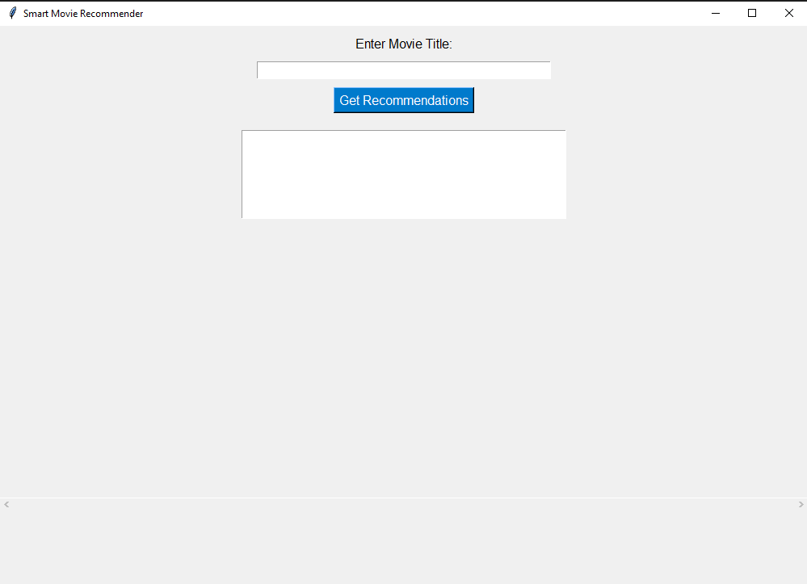
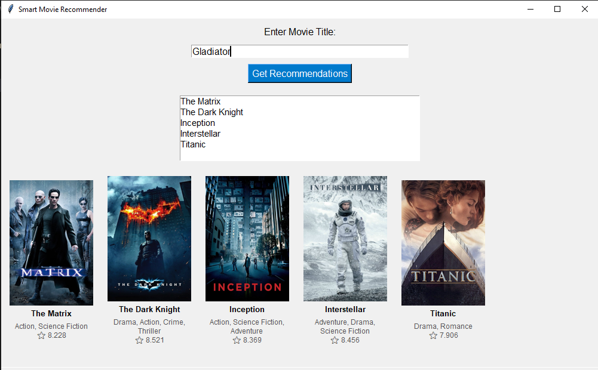

# 🎬 Smart Movie Recommender (AI-Powered)

A desktop movie recommendation app powered by Artificial Intelligence and built in Python.  
This app provides similar movie suggestions based on content using Natural Language Processing, shows posters, ratings, genres, and links to YouTube trailers — all in a slick GUI.

---

## 🚀 Features

✅ Content-based AI recommendations using **TF-IDF + Cosine Similarity**  
🎞 Fetches **movie posters, ratings, genres, and overviews** from TMDb API  
🖱 Click posters to **watch trailers on YouTube**  
💬 Hover on posters for **tooltips** with movie info  
📜 Scrollable, user-friendly GUI with **tkinter**  
📁 Local **CSV dataset** for offline support  

---

## 🧠 Tech Stack

- Python 3.x  
- tkinter (GUI)  
- pandas  
- scikit-learn  
- requests (TMDb API)  
- PIL (poster rendering)  

---

## 📂 Folder Structure

```
SmartMovieRecommender/
│
├── gui.py                  # Main GUI interface
├── recommender.py          # AI recommendation logic
├── data_handler.py         # CSV loader
├── tmdb_handler.py         # TMDb API requests
├── tooltip.py              # Hover tooltip for posters
├── requirements.txt        # Pip dependencies
├── data/
│   └── movies.csv          # Movie dataset
└── README.md
```

---

## 📷 Screenshots

> ## Home Screen of the App



## Movies Recommendation For GLADIATOR Movie


---

## ⚙️ Installation

1. Clone this repo:
   ```bash
   git clone https://github.com/rafay-184/smart-movie-recommender.git
   cd smart-movie-recommender
   ```

2. Install dependencies:
   ```bash
   pip install -r requirements.txt
   ```

3. Get your TMDb API Key:  
   👉 [https://www.themoviedb.org/settings/api](https://www.themoviedb.org/settings/api)  
   Replace `'b0e08b032e510d4fd706d637d2c6216c'` in `tmdb_handler.py`.

4. Run the app:
   ```bash
   python gui.py
   ```

---

## 🤖 AI Behind It

- Movie similarity is calculated using:
  - **TF-IDF Vectorizer** on movie `title`, `genre`, and `description`
  - **Cosine Similarity** to find closest matches

- TMDb API adds visuals: posters, rating, genre, overview, and trailer link

---

## 📽️ Demo

> You can record a short Loom/YouTube demo and link it here.

---

## 🙋 About Me

👋 I'm Rafay, a BS Artificial Intelligence student passionate about real-world ML apps.  
Let's connect on [LinkedIn](https://linkedin.com/in/your-link) or check out more at [GitHub](https://github.com/rafay-184).

---

## ⭐ Don't forget to star this repo if you like it!
